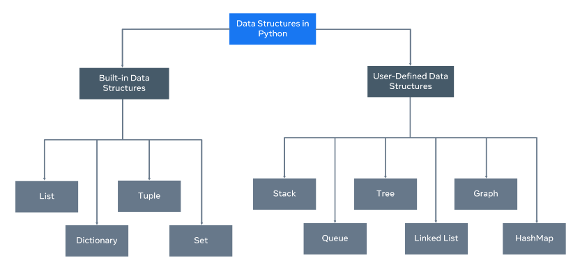
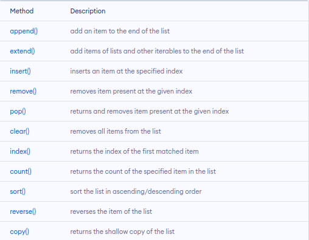
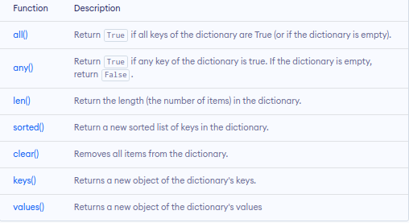
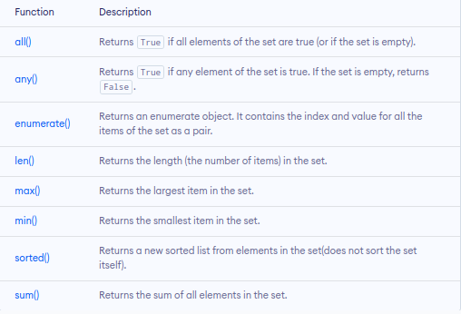
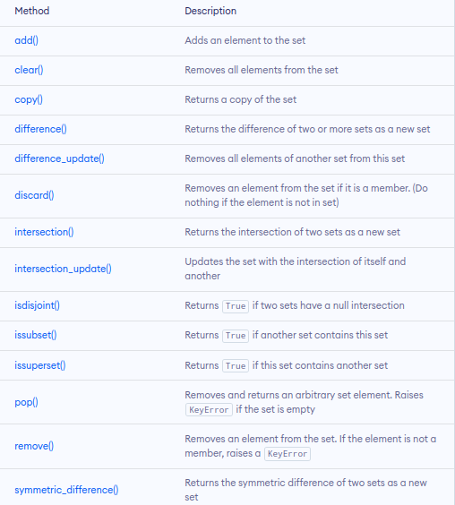
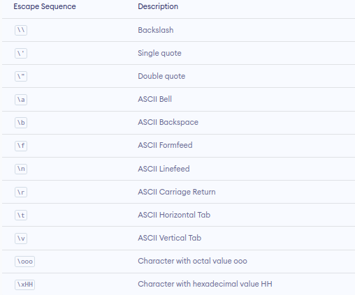
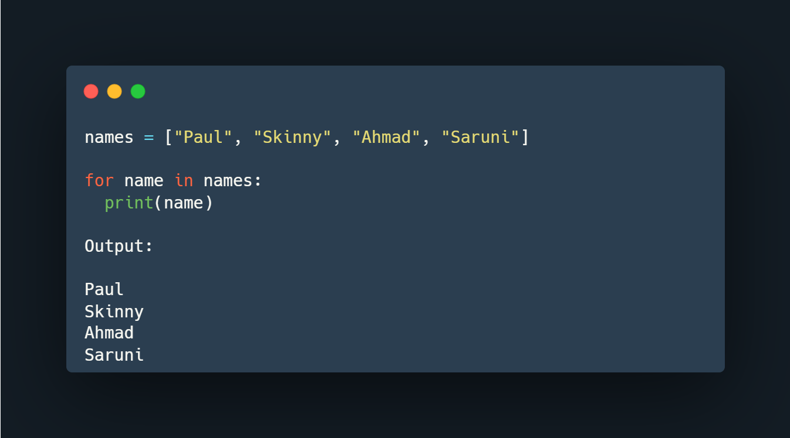
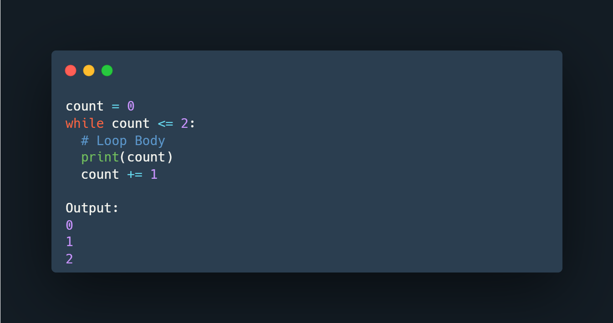
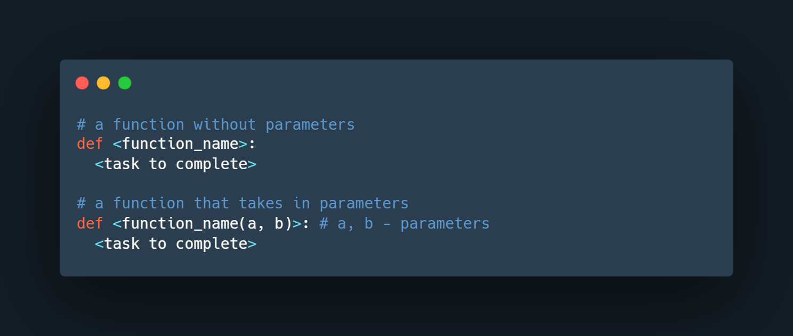

This program is about: 
# PLP PYTHON

> Python is a high-level programming language designed to be highly readable. It uses English like statements and keywords to create a software. It is a multipurpose programming language in that it can be used for web development, creating mobile applications, hacking, automation, machine learning and data science.

## VARIABLES IN PYTHON
> Python is a type-inferred language, so you don't have to explicitly define the variable type.

## PYTON DATATYPES
1. Numeric Data type
    <ul>
        <li>int - holds signed integers of non-limited length.</li>
        <li>float - holds floating decimal points and it's accurate up to 15 decimal places.</li>
        <li>complex - holds complex numbers.</li>
    </ul>

2. Sequnce Data type
    <ul>
        <li>List Data Type
        <li>Tuple Data Type
        <li>Range
    </ul>

3. String Data type

4. Mapping Data type
    <ul>
        <li>Dictionary
    </ul>
5. Boolean Data type

6. Set Data type

## TYPE CONVERSION
> It is converting data from one type to another.
There are two types of type conversion
<ul>
    <li>Implicit Conversion - automatic type conversion
    <li>Explicit Conversion - manual type conversion
</ul>

## COMMENTS IN PYTHON
> In Python, there are two types of comments:
<ul>
    <li>single-line comment
    <li>multi-line comment
</ul>

## BASIC OPERATIONS
<ul>
    <li>Arithmetic operators
    <li>Assignment Operators
    <li>Comparison Operators
    <li>Logical Operators
    <li>Bitwise Operators
    <li>Special Operators
</ul>

## PRINTING OUTPUT AND COLLECTIONG USER INPUT

#### 1. Input formatting
> name = str(input("What is your name: "))  
age = int(input("What is your age: "))  
location = str(input("What is your location: "))

#### 2. Output formatting
> print("Hello {}, you are {} years old and live in {}.".format(name, age, location))

## DATA STRUCTURES

> Mutability refers to data inside the data structure that can be modified. For example, you can either change, update, or delete the data when needed. A list is an example of a mutable data structure.

> An immutable data structure will not allow modification once the data has been set. The tuple is an example of an immutable data structure.

#### 1. Lists
> List = [] #empty list  
> languages = ["python", "HTML", "swift", "R"]

- List Methods

> 

#### 2. Tuples
> One cannot change the elements of a tuple once it is assigned  
Can also be created without using parentheses:

> my_tuple = ()  #empty tuple  
> my_tuple = (1, "Hello", 3.4)  
> my_tuple = 1, "Hello", 3.4

- Python Tuple Methods
> In Python ,methods that add items or remove items are not available with tuple.

#### 3. Dictionaries
> It stores elements in key/value pairs. Here, keys are unique identifiers that are associated with each value.

> emty_dic = {}  

> cities = {
    "Nepal":"Kathmandu",
    "Italy":"Rome",
    "England":"London"
}

> cities["Japan"] = "Tokyo" # added elements

> cities["Italy"] = "Romania" # changed element

> del cities["Nepal"] # deleted

- Dictionary Methods

#### 4. Set
> A set is a collection of unique data. That is, elements of a set cannot be duplicated.

> empty_set = set() #empty set

> reg_no = {"19/020", "19/021", "19/022", "19/020", "19/000"}

- Set Methods

- Set Operations
> A = {1, 3, 5, "Three"}

> B = {"One", "Three", "Five", 5}

> - Union  
> The union of two sets A and B include all the elements of set A and B.  
> print("Union is: ", A | B) # or print(A.union(B))

> - Set Intersection  
> The intersection of two sets A and B include the common elements between set A and B.  
> print("Intersection is: ", A & B) # or print(A.intersection(B))

> - Difference between Two Sets  
> The difference between two sets A and B include elements of set A that are not present on set B.  
> print("Difference is: ", A - B) # or print(A.difference(B))

> - Set Symmetric Difference  
> opposite of intersection  
> The symmetric difference between two sets A and B includes all elements of A and B without the common elements.  
> print("Set Symmetric Difference is: ", A ^ B)

#### 5. String
> use single quotes or double quotes to represent a string in Python

> Python, strings are immutable. That means the characters of a string cannot be changed.

- String Formatting
> name = 'Cathy'

> country = 'UK'

> print(f"{name} is from{country}")

## Escape Sequences

## CONDITIONAL STATEMENTS

1. if statement
2. if...else statement
3. if...elif...else statement

## LOOPS
1. for loop

2. while loop

## LIST COMPREHENSION
> numb1 = [2, 4, 6, 8]

> double = [i ** 2 for i in numb1]

> print(double)

## FUNCTIONS
